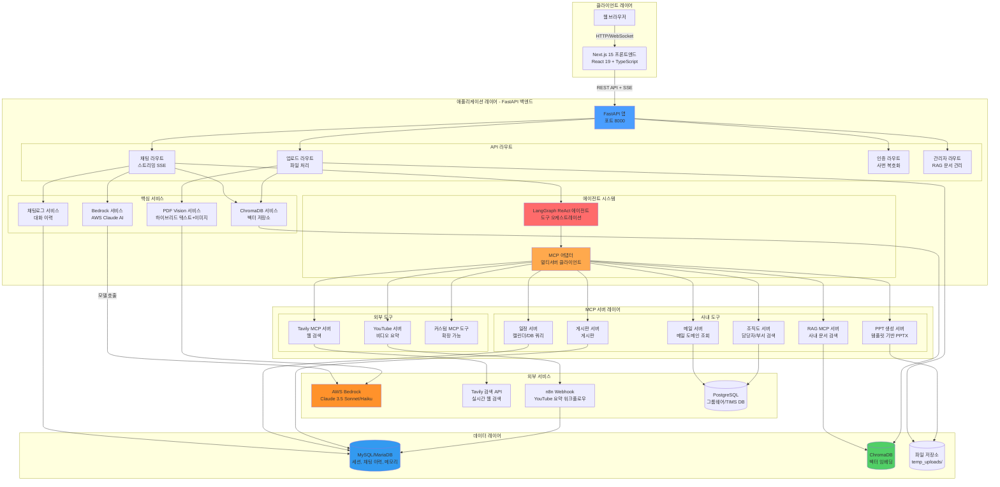
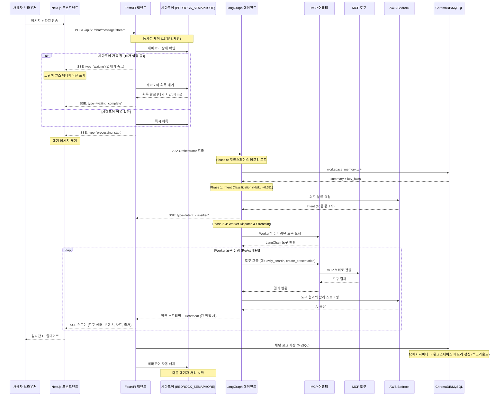
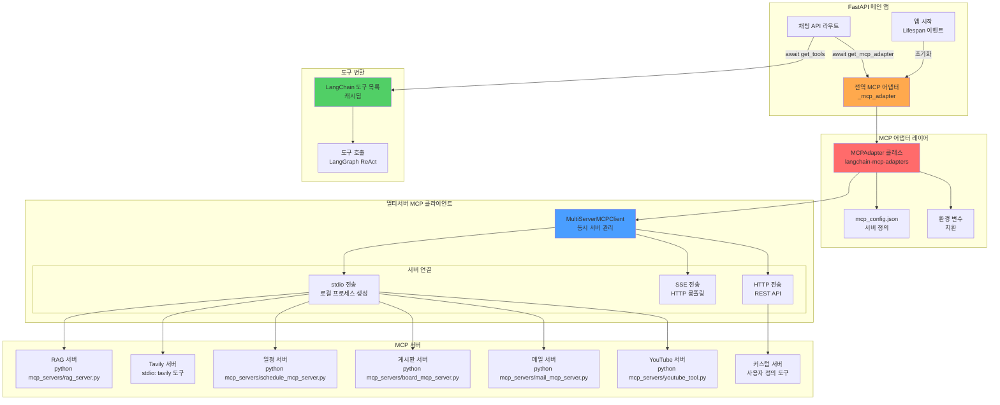
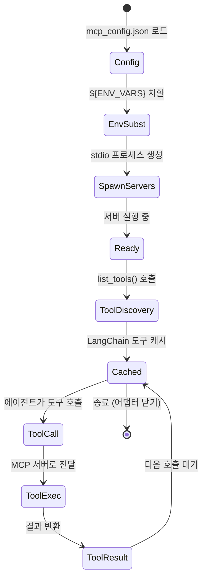

# LFChatbot 아키텍처 문서

> AWS Bedrock, LangGraph 에이전트, MCP 프로토콜 통합을 활용한 엔터프라이즈 AI 챗봇 시스템

## 목차

- [시스템 개요](#시스템-개요)
- [아키텍처 다이어그램](#아키텍처-다이어그램)
  - [상위 수준 시스템 아키텍처](#상위-수준-시스템-아키텍처)
  - [요청 흐름 다이어그램](#요청-흐름-다이어그램)
  - [데이터 흐름 및 저장소](#데이터-흐름-및-저장소)
  - [MCP 통합 아키텍처](#mcp-통합-아키텍처)
- [기술 스택](#기술-스택)
- [핵심 컴포넌트](#핵심-컴포넌트)
- [디자인 패턴](#디자인-패턴)
- [보안 및 성능](#보안-및-성능)

---

## 시스템 개요

LFChatbot은 현대적인 풀스택 아키텍처로 구축된 프로덕션급 엔터프라이즈 챗봇 시스템입니다. 이 시스템은 AWS Bedrock의 Claude AI 모델을 LangGraph와 함께 활용하여 에이전틱 AI 워크플로우를 구현하며, 확장 가능한 도구 통합을 위해 모델 컨텍스트 프로토콜 (Model Context Protocol, MCP)을 구현합니다.

**주요 기능:**
- 🤖 동적 도구 호출 기능을 갖춘 LangGraph 기반 리액트 에이전트 (ReAct Agent)
- 🔍 ChromaDB를 활용한 하이브리드 RAG (검색 증강 생성, Retrieval-Augmented Generation)
- 🛠️ 확장 가능한 도구 생태계를 위한 MCP (모델 컨텍스트 프로토콜)
- 📊 다중 소스 검색 (사용자 파일, 사내 문서, 웹, 데이터베이스)
- 🎨 서버 전송 이벤트 (Server-Sent Events)를 활용한 실시간 스트리밍 응답
- 📁 다양한 형식의 문서 처리 (PDF, DOCX, XLSX, PPTX)
- 📑 사내 템플릿 기반 PPT 프레젠테이션 자동 생성
- 💾 MySQL 기반 세션별 대화 관리
- 🧠 워크스페이스 메모리 시스템 (롤링 요약 + 핵심 사실 추출)
- 🏢 조직도/담당자 검색 (PostgreSQL v_org_chart 뷰)
- 🎬 YouTube 비디오 요약 (n8n 워크플로우 통합, DB 캐싱)
- 🔐 암호화된 사번 복호화 (AES 기반 인증)
- 📧 그룹웨어 메일 도메인 조회 (PostgreSQL 연동)
- 👨‍💼 관리자 페이지 (RAG 문서 업로드/관리)
- 💬 임베딩 가능한 채팅 위젯 (인트라넷용)
- 🆕 What's New 공지 시스템 (버전별 업데이트 안내)

---

## 아키텍처 다이어그램

### 상위 수준 시스템 아키텍처



### 요청 흐름 다이어그램



### 데이터 흐름 및 저장소

```mermaid
graph LR
    subgraph "입력 처리"
        Upload[파일 업로드<br/>PDF/DOCX/XLSX/PPTX]
        Query[사용자 쿼리]
        Images[이미지 첨부]
    end

    subgraph "임베딩 파이프라인"
        Extract[텍스트 추출<br/>PyPDF2/python-docx/openpyxl]
        Chunk[텍스트 청킹<br/>RecursiveCharacterSplitter<br/>1000자, 200 중첩]
        Embed[임베딩 모델<br/>BGE-m3-ko<br/>SentenceTransformer]
    end

    subgraph "저장 시스템"
        subgraph "ChromaDB 컬렉션"
            UserFiles[session_{session_id}<br/>사용자 업로드 파일]
            CorpDocs[dept_{dept_name}<br/>사내 문서]
        end

        subgraph "MySQL 테이블"
            ChatHistory[chat_history<br/>대화 로그]
            Sessions[sessions<br/>세션 메타데이터]
            Schedule[schedule_tables<br/>캘린더 이벤트]
            Board[board_tables<br/>게시판 게시물]
            YoutubeSummaries[youtube_summaries<br/>유튜브 요약 캐시]
        end
    end

    subgraph "검색"
        Search[벡터 검색<br/>코사인 유사도]
        SQLQuery[SQL 쿼리<br/>자연어]
    end

    Upload --> Extract
    Extract --> Chunk
    Chunk --> Embed
    Embed --> UserFiles
    Embed --> CorpDocs

    Query --> Search
    Query --> SQLQuery

    Search --> UserFiles
    Search --> CorpDocs
    SQLQuery --> Schedule
    SQLQuery --> Board
    SQLQuery --> YoutubeSummaries

    UserFiles --> ChatHistory
    CorpDocs --> ChatHistory
    Images --> ChatHistory

    style UserFiles fill:#51cf66
    style CorpDocs fill:#51cf66
    style ChatHistory fill:#339af0
    style Sessions fill:#339af0
    style Embed fill:#ffa94d
```

### MCP 통합 아키텍처



---

## 기술 스택

### 프론트엔드 스택

| 카테고리 | 기술 | 버전 | 목적 |
|----------|-----------|---------|---------|
| **프레임워크** | Next.js | 15.4.2 | App Router를 갖춘 React 메타프레임워크 |
| **UI 라이브러리** | React | 19.1.0 | 컴포넌트 기반 UI |
| **언어** | TypeScript | Latest | 타입 안전 개발 |
| **스타일링** | Tailwind CSS | 3.4.15 | 유틸리티 우선 CSS 프레임워크 |
| **UI 컴포넌트** | Radix UI | Various | 접근성 높은 컴포넌트 프리미티브 |
| **애니메이션** | Framer Motion | 12.23.6 | 부드러운 애니메이션 |
| **아이콘** | Lucide React | 0.525.0 | 아이콘 라이브러리 |
| **HTTP 클라이언트** | Fetch API | Native | API 통신 |

**주요 프론트엔드 기능:**
- 실시간 스트리밍을 위한 서버 전송 이벤트 (SSE)
- 채팅 상태 관리를 위한 커스텀 `useSimpleChat` 훅
- 구문 강조 기능이 있는 마크다운 렌더링
- 미리보기 기능이 있는 파일 업로드 (이미지, PDF, 문서)
- 모바일 지원을 포함한 반응형 디자인

### 백엔드 스택

| 카테고리 | 기술 | 버전 | 목적 |
|----------|-----------|---------|---------|
| **프레임워크** | FastAPI | 0.115.6 | 고성능 비동기 웹 프레임워크 |
| **서버** | Uvicorn | 0.35.0 | ASGI 서버 |
| **언어** | Python | 3.10+ | 백엔드 프로그래밍 |
| **AI 프레임워크** | LangChain | 0.3.80 | LLM 오케스트레이션 |
| **에이전트 프레임워크** | LangGraph | 0.2.52 | 상태 유지 멀티액터 에이전트 |
| **LLM 제공자** | AWS Bedrock | Boto3 1.39.4 | Claude 3.5 Sonnet 액세스 |
| **벡터 DB** | ChromaDB | 1.0.15 | 문서 임베딩 |
| **임베딩** | Sentence Transformers | 5.0.0 | BGE-m3-ko 모델 |
| **데이터베이스** | MySQL/MariaDB | - | 관계형 데이터 저장소 |
| **ORM** | SQLAlchemy | 2.0.36 | 데이터베이스 추상화 |
| **MCP** | FastMCP | 2.13.1 | MCP 서버 구현 |
| **MCP 통합** | langchain-mcp-adapters | 0.1.14 | MCP 프로토콜 통합 |
| **PPT 생성** | python-pptx | Latest | PowerPoint 프레젠테이션 생성 |
| **스케줄러** | APScheduler | Latest | 백그라운드 정리 작업 |
| **외부 워크플로우** | n8n Webhook | - | YouTube 요약 등 |

**주요 백엔드 기능:**
- 비동기 제너레이터를 사용한 스트리밍 응답
- 블로킹 ChromaDB 작업을 위한 스레드 풀 실행자
- JWT 인증 (Python-JOSE)
- 교차 출처 요청을 위한 CORS 미들웨어
- 컨텍스트 정보를 포함한 구조화된 로깅

---

## 핵심 컴포넌트

### 1. 프론트엔드 아키텍처

```
frontend/
├── app/                          # Next.js App Router
│   ├── (chat)/                   # 채팅 레이아웃 그룹
│   │   ├── page.tsx              # 새 채팅 페이지
│   │   ├── chat/[id]/page.tsx   # 기존 채팅 페이지
│   │   └── api/                  # API 라우트 (백엔드 프록시)
│   ├── admin/                    # 관리자 페이지
│   │   └── page.tsx              # RAG 문서 관리
│   ├── globals.css               # 전역 스타일
│   └── layout.tsx                # 루트 레이아웃
├── components/                    # React 컴포넌트
│   ├── chat.tsx                  # 메인 채팅 인터페이스
│   ├── message.tsx               # 메시지 버블
│   ├── multimodal-input.tsx     # 파일 업로드 기능이 있는 입력
│   ├── app-sidebar.tsx           # 대화 이력
│   ├── search-images.tsx         # Tavily 이미지 결과
│   ├── sources.tsx               # 검색 출처 표시
│   ├── youtube-summary-modal.tsx # YouTube 요약 모달
│   └── ui/                       # 재사용 가능한 UI 컴포넌트
├── hooks/                         # 커스텀 React 훅
│   ├── use-simple-chat.ts        # 채팅 상태 및 SSE 스트리밍
│   ├── use-messages.tsx          # 메시지 관리
│   └── use-scroll-to-bottom.tsx  # 자동 스크롤 동작
└── lib/                           # 유틸리티 함수
    ├── types.ts                   # TypeScript 정의
    └── utils.ts                   # 헬퍼 함수
```

**컴포넌트 책임:**

- **`Chat` 컴포넌트**: 전체 채팅 UI 오케스트레이션, 파일 첨부 관리, 메시지 전송 처리
- **`useSimpleChat` 훅**: 핵심 채팅 로직 - SSE 연결, 스트리밍, 메시지 상태, 오류 처리, 대기 상태 관리
  - `waiting` 이벤트 수신 시 `__WAITING__` 마커 생성
  - `waiting_complete` 이벤트 수신 시 대기 메시지 제거
  - `processing_start` 이벤트 수신 시 처리 시작 알림
- **`Response` 컴포넌트**: 마크다운 렌더링, `__WAITING__` 마커 감지 시 노란색 펄스 애니메이션 표시
- **`MultimodalInput`**: 파일 드래그 앤 드롭, 이미지 미리보기, 전송 버튼이 있는 텍스트 입력
- **`Message` 컴포넌트**: 마크다운, 코드 블록, 이미지가 포함된 사용자/어시스턴트 메시지 렌더링
- **`SearchImages`/`Sources`**: 이미지 및 출처 링크와 함께 Tavily 웹 검색 결과 표시
- **`YoutubeSummaryModal`**: YouTube 요약 결과 표시 (제목, 인사이트, 키워드, 타임스탬프별 세그먼트)
- **`AdminPage`**: RAG 문서 업로드, 컬렉션 관리, 임베딩된 문서 조회/삭제

### 2. 백엔드 아키텍처

```
backend/
├── app/
│   ├── main.py                    # FastAPI 앱 진입점 (Lifespan, 스케줄러 초기화)
│   ├── api/                       # API 라우트
│   │   └── routes/
│   │       ├── chat.py            # 채팅 스트리밍 엔드포인트
│   │       ├── chat_a2a.py        # A2A 라우트 (레거시 호환)
│   │       ├── upload.py          # 파일 업로드 엔드포인트
│   │       ├── workspace.py       # 워크스페이스 CRUD 엔드포인트
│   │       └── auth.py            # 인증 엔드포인트 (사번 복호화)
│   ├── agents/                    # LangGraph 에이전트 시스템
│   │   ├── orchestrator.py        # A2A Orchestrator (메인 라우터)
│   │   ├── intent_classifier.py   # Haiku 기반 의도 분류기
│   │   ├── state.py               # Intent 열거형, AgentState, RequestContext
│   │   ├── a2a_streaming.py       # SSE 스트리밍 + Heartbeat 시스템
│   │   ├── tools/                 # 직접 호출 도구 (MCP 바이패스)
│   │   │   └── rag_direct_tools.py  # ChromaDB 직접 검색 (0.1초 이내)
│   │   └── workers/               # 전문화 Worker 에이전트
│   │       ├── base_worker.py     # Worker 추상 클래스 (LucidAI 아이덴티티)
│   │       ├── direct_worker.py   # 일반 대화 Worker
│   │       ├── web_search_worker.py  # 웹 검색 Worker
│   │       ├── user_files_worker.py  # 사용자 파일 Worker
│   │       ├── corp_rag_worker.py    # 사내 문서 + 조직도 Worker
│   │       ├── visualization_worker.py  # PDF/차트 생성 Worker
│   │       ├── ppt_worker.py         # PPT 생성 Worker (신규)
│   │       ├── youtube_worker.py     # YouTube 요약 Worker
│   │       ├── url_fetch_worker.py   # URL 콘텐츠 추출 Worker
│   │       ├── it_support_worker.py  # IT VOC + 조직도 Worker
│   │       └── acct_support_worker.py  # 회계 VOC + 조직도 Worker
│   ├── services/                  # 비즈니스 로직 서비스
│   │   ├── bedrock_service.py     # AWS Bedrock 통합 (Haiku 텍스트 생성 포함)
│   │   ├── chromadb_service.py    # 벡터 데이터베이스 작업
│   │   ├── chat_log_service.py    # 대화 영속성 + 메모리 트리거
│   │   ├── memory_service.py      # 워크스페이스 메모리 (롤링 요약)
│   │   ├── pdf_vision_service.py  # 하이브리드 PDF 처리
│   │   ├── workspace_service.py   # 워크스페이스 관리
│   │   └── youtube_summary_service.py  # YouTube 요약 (n8n 통합)
│   ├── adapters/                  # 외부 통합
│   │   └── mcp_adapter.py         # MCP 프로토콜 어댑터
│   ├── mcp_servers/               # MCP 서버 구현
│   │   ├── rag_server.py          # 사내 문서 검색
│   │   ├── org_chart_mcp_server.py  # 조직도/담당자 검색 (PostgreSQL)
│   │   ├── ppt_generator/         # PPT 생성 MCP 서버
│   │   │   ├── server.py          # PPT 생성 도구 (create_presentation 등)
│   │   │   └── template_indexer.py  # 템플릿 메타데이터 추출기
│   │   ├── pdf_generator/         # PDF 생성 MCP 서버
│   │   │   └── server.py
│   │   ├── chart_generator/       # 차트 생성 MCP 서버
│   │   │   └── server.py
│   │   ├── works_it_mcp_server.py   # IT VOC 검색
│   │   ├── works_acct_mcp_server.py # 회계 VOC 검색
│   │   ├── schedule_mcp_server.py # 캘린더/일정 쿼리
│   │   ├── board_mcp_server.py    # 게시판 쿼리
│   │   ├── mail_mcp_server.py     # 메일 도메인 조회
│   │   └── youtube_tool.py        # YouTube 요약 도구
│   ├── utils/                     # 유틸리티
│   │   ├── crypto.py              # 암호화/복호화
│   │   └── chromadb_cleanup.py    # 세션 컬렉션 자동 정리 스케줄러
│   ├── core/                      # 핵심 설정
│   │   ├── config.py              # 앱 설정
│   │   ├── database.py            # DB 연결 풀 (PooledDB)
│   │   └── model_config.py        # 모델 설정 (Sonnet/Haiku)
│   └── models/                    # Pydantic 모델
├── data/                          # 영구 데이터
│   ├── chromadb_user/             # 사용자 파일 임베딩
│   ├── chromadb_admin/            # 사내 문서 임베딩
│   ├── pdf_output/                # 생성된 PDF 파일
│   ├── chart_output/              # 생성된 차트 이미지
│   ├── ppt_output/                # 생성된 PPT 파일
│   ├── ppt_template/              # PPT 템플릿 + 메타데이터
│   └── temp_uploads/              # 임시 파일 저장소
├── metadata/                      # MCP 서버용 메타데이터
│   ├── MCP_GW_MAIL.md             # 메일 스키마 가이드
│   ├── MCP_GW_USER.md             # 사용자 스키마 가이드
│   ├── MCP_GW_WORKS_IT.md         # IT VOC 스키마 가이드
│   ├── MCP_GW_WORKS_ACCT.md       # 회계 VOC 스키마 가이드
│   └── MCP_ORG_CHART.md           # 조직도 뷰 스키마 가이드
├── migrations/                    # DB 마이그레이션
│   ├── add_workspace_memory.sql   # workspace_memory 테이블 생성
│   └── change_workspace_id_to_uuid.sql  # workspace_id UUID 전환
├── mcp_config.json                # MCP 서버 설정
└── requirements.txt               # Python 의존성
```

**서비스 책임:**

- **`BedrockService`**: AWS Bedrock API 호출, 스트리밍 응답, 이미지 지원, Haiku 텍스트 생성 (`generate_text_haiku`)
- **`ChromaDBService`**: 파일 업로드, 텍스트 추출, 청킹, 임베딩, 벡터 검색
- **`ChatLogService`**: 채팅 기록 저장/검색, 세션 관리, 메모리 갱신 트리거
- **`WorkspaceMemoryService`**: 롤링 요약 생성, 핵심 사실 추출, 메모리 CRUD (MySQL)
- **`WorkspaceService`**: 워크스페이스 생성/조회/수정/삭제, 파일 관리
- **`YoutubeSummaryService`**: YouTube URL 파싱, n8n webhook 호출, DB 캐싱 (중복 요청 방지)
- **`MCPAdapter`**: MCP 설정 로드, MCP 서버 생성, 도구를 LangChain 형식으로 변환

**동시성 제어:**

- **`BEDROCK_SEMAPHORE`**: asyncio.Semaphore(15)를 사용한 동시 Bedrock API 호출 제한
  - AWS RPM 1000 (≈ TPS 16) 기준 안전 마진으로 15 설정
  - Throttling 에러 방지 및 대기열 기반 순차 처리
  - 대기 상태 실시간 피드백 제공 (`waiting`, `waiting_complete`, `processing_start` SSE 이벤트)

### 3. LangGraph 에이전트 시스템

이 시스템은 리액트 (ReAct, Reasoning + Acting) 패턴을 위해 LangGraph의 `create_react_agent`를 사용합니다:

**에이전트 워크플로우:**
1. **사용자 쿼리 수신** (대화 이력 포함)
2. **추론** - 어떤 도구를 사용할지 결정
3. **행동** - MCP 도구 호출 (검색, DB 쿼리 등)
4. **관찰** - 도구 결과 확인
5. **종합** - 도구 출력과 함께 최종 응답 생성
6. **스트리밍** - 프론트엔드로 실시간 응답 전송

**도구 실행 흐름:**
```python
# chat.py - 에이전트 생성 및 실행
llm = ChatBedrock(model_id="...", streaming=True)
agent = create_react_agent(llm, tools, state_modifier=system_prompt)

async for event in agent.astream_events(message_payload, version="v2"):
    if event["event"] == "on_tool_start":
        # 프론트엔드로 도구 상태 전송 (로딩 애니메이션)
        yield tool_status_message
    elif event["event"] == "on_tool_end":
        # 도구 결과 추출 (이미지, 출처, 데이터)
        yield tool_result_data
    elif event["event"] == "on_chat_model_stream":
        # AI 응답 청크 스트리밍
        yield content_chunk
```

### 4. MCP (모델 컨텍스트 프로토콜) 통합

**MCP란 무엇인가?**
MCP는 LLM 애플리케이션과 외부 도구/데이터 소스 간의 통신을 표준화하기 위한 프로토콜입니다. 각 MCP 서버는 AI 에이전트가 호출할 수 있는 도구를 노출합니다.

**MCP 서버 생명주기:**


**MCP 서버 예시:**

1. **RAG 서버** (`rag_server.py`):
   - 도구: `search_hr_docs`, `search_accounting_docs`, `search_it_docs` 등
   - 목적: 부서별 사내 문서 검색
   - 구현: 관리자 컬렉션에 대한 ChromaDB 벡터 검색

2. **Tavily 서버** (외부):
   - 도구: `tavily_search`, `tavily_answer`
   - 목적: 이미지 및 출처가 포함된 실시간 웹 검색
   - 구현: MCP를 통한 Tavily API 통합

3. **일정 서버** (`schedule_mcp_server.py`):
   - 도구: `get_schedule_guide`, `execute_schedule_query`
   - 목적: 캘린더 쿼리를 위한 자연어-SQL 변환
   - 구현: user_id 필터링이 있는 MySQL 쿼리

4. **메일 서버** (`mail_mcp_server.py`):
   - 도구: `get_mail_guide`, `get_user_guide`, `execute_mail_query`
   - 목적: 그룹웨어 메일 도메인 조회
   - 구현: PostgreSQL 쿼리, 메타데이터 가이드 기반 쿼리 생성

5. **YouTube 서버** (`youtube_tool.py`):
   - 도구: `youtube_summarize`
   - 목적: YouTube 비디오 요약 (제목, 인사이트, 키워드, 세그먼트)
   - 구현: n8n webhook 호출, MariaDB 캐싱 (중복 요청 방지)

6. **PPT 생성 서버** (`ppt_generator/server.py`):
   - 도구: `create_presentation`, `list_ppt_templates`, `list_generated_ppts`
   - 목적: 사내 .pptx 템플릿 기반 프레젠테이션 자동 생성
   - 구현: python-pptx, 템플릿 메타데이터 기반 레이아웃 적용
   - 지원 요소: TextBox, Table (병합 헤더, 교대행), Native Chart (line/column/bar/pie/area/scatter), Image
   - 보조: `template_indexer.py` - 템플릿 파싱 → `template_metadata.json` 생성

7. **조직도 서버** (`org_chart_mcp_server.py`):
   - 도구: `execute_org_chart_query`
   - 목적: 사내 직원의 부서, 직책, 직무, 근무지 검색
   - 구현: FastMCP + asyncpg, PostgreSQL `v_org_chart` 뷰 쿼리
   - 보안: SELECT만 허용, 4단계 검증 파이프라인

8. **IT VOC 서버** (`works_it_mcp_server.py`):
   - 도구: `execute_it_voc_query`
   - 목적: IT 지원 사례 (VOC) 검색
   - 구현: PostgreSQL TIMS DB 쿼리, SQL 검증

9. **회계 VOC 서버** (`works_acct_mcp_server.py`):
   - 도구: `execute_acct_voc_query`
   - 목적: 회계/재경 지원 사례 (VOC) 검색
   - 구현: PostgreSQL TIMS DB 쿼리, SQL 검증

---

## 디자인 패턴

### 1. 리포지토리 패턴 (서비스 레이어)

모든 데이터 액세스는 서비스 클래스를 통해 추상화됩니다:

```python
class ChromaDBService:
    def __init__(self, data_path: str):
        self.client = chromadb.PersistentClient(path=data_path)

    async def upload_file(self, file_content, filename, user_id, session_id):
        # 파일 처리 로직
        pass

    async def search(self, query, user_id, session_id, limit=5):
        # 벡터 검색 로직
        pass
```

**장점:**
- 중앙 집중화된 데이터 액세스 로직
- 테스트를 위한 쉬운 모킹
- 관심사의 분리

### 2. 싱글톤 패턴 (서비스 인스턴스)

서비스는 한 번 생성되어 요청 간에 재사용됩니다:

```python
_bedrock_service = None

def get_bedrock_service() -> BedrockService:
    global _bedrock_service
    if _bedrock_service is None:
        _bedrock_service = BedrockService()
    return _bedrock_service
```

**장점:**
- 초기화 오버헤드 감소
- 연결 풀링 (MySQL, ChromaDB)
- 요청 간 일관된 상태

### 3. 의존성 주입 (FastAPI)

서비스 주입을 위한 FastAPI의 `Depends` 시스템:

```python
@router.post("/v1/chat/message/stream")
async def chat_stream(
    request: ChatRequest,
    bedrock: BedrockService = Depends(get_bedrock_service),
    chromadb: ChromaDBService = Depends(get_chromadb_service),
):
    # 주입된 서비스 사용
    pass
```

**장점:**
- 테스트 가능 (모의 객체 주입 가능)
- 명확한 의존성
- 자동 리소스 관리

### 4. 전략 패턴 (RAG vs 에이전트 경로)

파일 존재 여부에 따른 채팅 라우팅:

```python
if has_files:
    # RAG 전략: 파일 검색 + 생성
    file_results = await chromadb.search(query, session_id)
    async for chunk in bedrock.stream_chat(query, context=file_results):
        yield chunk
else:
    # 에이전트 전략: 도구와 함께 LangGraph 사용
    agent = create_react_agent(llm, tools)
    async for event in agent.astream_events(message):
        yield event
```

### 5. 옵저버 패턴 (SSE 스트리밍)

서버 전송 이벤트를 통한 실시간 업데이트:

```python
async def generate():
    yield f"data: {json.dumps({'type': 'tool_status', 'message': '검색 중...'})}\n\n"
    yield f"data: {json.dumps({'type': 'content', 'chunk': '안녕하세요'})}\n\n"
    yield f"data: {json.dumps({'type': 'search_images', 'images': [...]})}\n\n"
    yield f"data: {json.dumps({'complete': True})}\n\n"

return StreamingResponse(generate(), media_type="text/event-stream")
```

**프론트엔드 소비:**
```typescript
const reader = response.body?.getReader();
while (true) {
  const { done, value } = await reader.read();
  if (line.startsWith('data: ')) {
    const data = JSON.parse(line.slice(6));
    if (data.type === 'content') {
      allChunks.push(data.chunk);
      updateUI(allChunks.join(''));
    }
  }
}
```

### 6. 세마포어 패턴 (동시성 제어)

AWS Bedrock API 호출을 제한하여 Throttling 방지:

```python
# 전역 세마포어 선언 (chat.py:26)
BEDROCK_SEMAPHORE = asyncio.Semaphore(15)

async def chat_stream(request: ChatRequest):
    async def generate():
        # 세마포어 상태 확인
        semaphore_locked = BEDROCK_SEMAPHORE.locked()
        if semaphore_locked:
            # 대기 알림 전송
            yield f"data: {json.dumps({'type': 'waiting', 'message': '다른 사용자의 요청을 처리 중입니다. 잠시만 기다려주세요...'})}\n\n"

        # 세마포어 획득 시도 (대기 시간 측정)
        semaphore_wait_start = time.time()
        async with BEDROCK_SEMAPHORE:
            semaphore_wait_time = int((time.time() - semaphore_wait_start) * 1000)

            if semaphore_wait_time > 100:
                # 100ms 이상 대기했으면 완료 알림
                yield f"data: {json.dumps({'type': 'waiting_complete', 'wait_time_ms': semaphore_wait_time})}\n\n"

            # 처리 시작 알림
            yield f"data: {json.dumps({'type': 'processing_start'})}\n\n"

            # 실제 Bedrock API 호출
            async for event in agent.astream_events(...):
                yield ...

        # 블록 종료 시 세마포어 자동 해제
```

**프론트엔드 대기 상태 처리:**
```typescript
// use-simple-chat.ts
if (data.type === 'waiting') {
  // 대기 메시지 표시
  currentToolStatus = `\n\n__WAITING__:${data.message}__END__\n\n`;
  updateUI();
}

if (data.type === 'processing_start') {
  // 대기 메시지 제거
  currentToolStatus = '';
  updateUI();
}
```

**UI 렌더링 (response.tsx):**
```typescript
if (part?.startsWith('__WAITING__:')) {
  return (
    <span className="animate-pulse text-yellow-600">
      ⏳ {message}
    </span>
  );
}
```

**장점:**
- AWS RPM/TPM 제한 준수
- Throttling 에러 완전 차단
- 사용자에게 대기 상태 명확히 전달
- 순차 대기열 자동 관리

---

## 보안 및 성능

### 보안 조치

1. **인증**:
   - 만료 기능이 있는 JWT 토큰
   - 모든 요청에 대한 사용자 ID 검증
   - 세션 기반 격리 (사용자는 다른 세션에 액세스할 수 없음)

2. **입력 검증**:
   - 요청 검증을 위한 Pydantic 모델
   - 파일 타입 화이트리스트 (PDF, DOCX, XLSX, PPTX)
   - SQL 인젝션 방지 (매개변수화된 쿼리)

3. **환경 변수**:
   - `.env` 파일의 민감한 키 (AWS, Tavily)
   - 런타임 시크릿을 위한 `${VAR}` 치환을 사용하는 MCP 설정

4. **CORS**:
   - 프로덕션 환경의 특정 출처에 대해 구성
   - 인증된 요청에 대한 자격 증명 허용

### 성능 최적화

1. **모든 곳에 Async/Await**:
   - FastAPI 완전 비동기
   - LangGraph의 동시 도구 실행
   - 스레드 풀을 통한 비차단 ChromaDB 작업

2. **동시성 제어 (Semaphore 패턴)**:
   - AWS Bedrock API 동시 호출 제한 (15 TPS)
   - Throttling 에러 방지 (RPM 1000 기준 안전 마진)
   - 대기열 기반 순차 처리로 안정성 보장
   - 실시간 대기 상태 피드백으로 사용자 경험 개선

3. **캐싱**:
   - 첫 로드 후 MCP 도구 캐시
   - 싱글톤 서비스 (Bedrock, ChromaDB)
   - ChromaDB에 캐시된 세션 임베딩

4. **스트리밍**:
   - 실시간 응답 전달을 위한 SSE
   - 즉시 첫 토큰 (낮은 TTFT)
   - 청크 처리로 메모리 감소

4. **데이터베이스 인덱싱**:
   - `user_id`, `session_id`, `created_at`에 대한 MySQL 인덱스
   - ChromaDB 벡터 인덱스 (HNSW 알고리즘)

5. **연결 풀링**:
   - MySQL을 위한 SQLAlchemy 연결 풀
   - 영구 ChromaDB 클라이언트
   - 단일 Bedrock boto3 클라이언트

### 확장성 고려사항

- **수평 확장**: 로드 밸런서 뒤의 상태 비저장 FastAPI 인스턴스
- **데이터베이스 샤딩**: 사용자/세션별 ChromaDB 컬렉션
- **큐 시스템**: 장시간 실행되는 파일 처리를 위한 백그라운드 작업
- **CDN**: CDN을 통해 제공되는 정적 자산 (Next.js 배포)

---

## 설정 파일

### `mcp_config.json` 예시

```json
{
  "mcpServers": {
    "rag": {
      "transport": "stdio",
      "command": "python",
      "args": ["backend/app/mcp_servers/rag_server.py"],
      "description": "사내 문서 검색",
      "enabled": true
    },
    "tavily": {
      "transport": "stdio",
      "command": "npx",
      "args": ["-y", "@modelcontextprotocol/server-tavily"],
      "env": {
        "TAVILY_API_KEY": "${TAVILY_API_KEY}"
      },
      "description": "이미지가 포함된 웹 검색",
      "enabled": true
    },
    "schedule": {
      "transport": "stdio",
      "command": "python",
      "args": ["backend/app/mcp_servers/schedule_mcp_server.py"],
      "description": "캘린더 및 일정 쿼리",
      "enabled": true
    },
    "board": {
      "transport": "stdio",
      "command": "python",
      "args": ["backend/app/mcp_servers/board_mcp_server.py"],
      "description": "그룹웨어 게시판 조회",
      "enabled": true
    },
    "mail": {
      "transport": "stdio",
      "command": "python",
      "args": ["backend/app/mcp_servers/mail_mcp_server.py"],
      "description": "그룹웨어 메일 DB 조회",
      "enabled": true
    },
    "youtube": {
      "transport": "stdio",
      "command": "python",
      "args": ["backend/app/mcp_servers/youtube_tool.py"],
      "description": "유튜브 비디오 요약",
      "enabled": true
    },
    "works_it": {
      "transport": "stdio",
      "command": "python",
      "args": ["backend/app/mcp_servers/works_it_mcp_server.py"],
      "description": "IT VOC 해결 사례 검색",
      "enabled": true
    },
    "works_acct": {
      "transport": "stdio",
      "command": "python",
      "args": ["backend/app/mcp_servers/works_acct_mcp_server.py"],
      "description": "회계/재경 VOC 해결 사례 검색",
      "enabled": true
    },
    "org_chart": {
      "transport": "stdio",
      "command": "python",
      "args": ["backend/app/mcp_servers/org_chart_mcp_server.py"],
      "description": "조직도/담당자 검색",
      "enabled": true
    },
    "ppt_generator": {
      "transport": "stdio",
      "command": "python",
      "args": ["backend/app/mcp_servers/ppt_generator/server.py"],
      "description": "사내 템플릿 기반 PPT 생성",
      "enabled": true
    },
    "pdf_generator": {
      "transport": "stdio",
      "command": "python",
      "args": ["backend/app/mcp_servers/pdf_generator/server.py"],
      "description": "마크다운 → PDF 변환",
      "enabled": true
    },
    "chart_generator": {
      "transport": "stdio",
      "command": "python",
      "args": ["backend/app/mcp_servers/chart_generator/server.py"],
      "description": "데이터 시각화 차트 생성",
      "enabled": true
    }
  }
}
```

### 환경 변수 (`.env`)

```bash
# AWS Bedrock
AWS_ACCESS_KEY_ID=your_access_key
AWS_SECRET_ACCESS_KEY=your_secret_key
AWS_REGION=us-east-1
BEDROCK_MODEL_ID=anthropic.claude-3-5-sonnet-20240620-v1:0

# 데이터베이스
MYSQL_HOST=localhost
MYSQL_USER=chatbot
MYSQL_PASSWORD=password
MYSQL_DATABASE=lf_chatbot

# 외부 API
TAVILY_API_KEY=tvly-xxxxx

# n8n 워크플로우
N8N_YOUTUBE_WEBHOOK_URL=http://localhost:5678/webhook/youtube-summary
N8N_WEBHOOK_TIMEOUT=15

# 암호화 키
AES_KEY=your_aes_key_16bytes

# 앱 설정
FRONTEND_URL=http://localhost:3000
BACKEND_PORT=8000
```

---

## 배포

### 로컬 개발

1. **백엔드**:
   ```bash
   cd backend
   pip install -r requirements.txt
   python app/main.py
   ```

2. **프론트엔드**:
   ```bash
   cd frontend
   npm install
   npm run dev
   ```

### 프로덕션 배포

**백엔드** (FastAPI):
- Uvicorn 워커와 함께 AWS ECS/EC2에 배포
- 역방향 프록시로 Nginx 사용
- CPU/메모리 기반 자동 확장 구성

**프론트엔드** (Next.js):
- Vercel 또는 AWS Amplify에 배포
- API 라우트를 위한 엣지 함수 활성화
- 정적 자산에 대한 CDN 캐싱 구성

**데이터베이스**:
- 읽기 복제본이 있는 AWS RDS의 MySQL
- 영구 EBS 볼륨의 ChromaDB
- 특정 시점 복구 기능이 있는 정기 백업

---

## 특별 기능 상세

### YouTube 요약 시스템

**아키텍처 플로우:**
```
1. 사용자: "이 영상 요약해줘 https://youtu.be/VIDEO_ID"
2. LangGraph Agent: youtube_summarize 도구 자동 호출
3. YouTube Summary Service:
   - video_id 추출 (정규식 파싱)
   - DB 캐시 확인 (youtube_summaries 테이블)
   - 캐시 미스 → n8n webhook POST 요청
   - n8n: YouTube 자막 다운로드 → Claude API로 요약 생성
   - 응답: {title, summary, insight, keywords, segments}
4. DB 저장: MariaDB에 캐싱 (중복 요청 시 즉시 응답)
5. Frontend: YouTube 요약 카드 렌더링 → 클릭 시 모달 오픈
```

**데이터베이스 스키마:**
```sql
CREATE TABLE youtube_summaries (
    id INT AUTO_INCREMENT PRIMARY KEY,
    video_id VARCHAR(20) NOT NULL UNIQUE,
    title TEXT NOT NULL,
    original_link VARCHAR(500) NOT NULL,
    summary TEXT NOT NULL,
    insight TEXT,
    keywords JSON,
    segments JSON,  -- [{start_time, title, content}]
    created_at DATETIME DEFAULT CURRENT_TIMESTAMP,
    user_id VARCHAR(100)
);
```

**UI 기능:**
- 타임스탬프 클릭 시 YouTube로 이동 (`?t=초` 파라미터)
- 키워드 태그 표시
- Key Insight 강조 박스
- 세그먼트별 내용 정리

### 관리자 RAG 관리 시스템

**기능:**
1. **문서 업로드**: 드래그 앤 드롭, 다중 파일 지원 (PDF, DOCX, PPTX, TXT)
2. **컬렉션 관리**:
   - 기존 컬렉션 선택 또는 신규 생성
   - 컬렉션 삭제 (전체 임베딩 제거)
3. **임베딩 파이프라인**:
   - 백엔드 API 호출 (`/api/v1/admin/upload/file`)
   - ChromaDB에 자동 저장 (`admin-{collection}` 형식)
4. **문서 목록**:
   - 파일별 메타데이터 표시 (청크 수, 업데이트 시간)
   - 개별 문서 삭제 기능

**API 엔드포인트:**
- `GET /api/v1/admin/upload/collections` - 컬렉션 목록
- `GET /api/v1/admin/upload/list?collection={name}` - 문서 목록
- `POST /api/v1/admin/upload/file` - 파일 업로드/임베딩
- `DELETE /api/v1/admin/upload/file/{collection}/{file_id}` - 문서 삭제
- `DELETE /api/v1/admin/upload/collection/{name}` - 컬렉션 삭제

---

## A2A 계층적 에이전트 아키텍처

### 개요

A2A(Agent-to-Agent) 아키텍처는 **"분할 정복"** 전략을 사용합니다:
- **Orchestrator (Haiku)**: 빠른 의도 분류 (~0.3-0.5초)
- **Worker (Haiku/Sonnet)**: 전문화된 도구 세트로 빠른 처리
- 기존 단일 Agent 대비 **TTFB 50% 단축**, **비용 40% 절감**

### 아키텍처 다이어그램

```
사용자 질문
     │
     ▼
┌─────────────────────────────────────┐
│  Orchestrator (Haiku)               │  ← ~0.3-0.5초
│  - 의도 분류 (7가지 중 1개)          │
│  - Worker 선택                       │
└─────────────────┬───────────────────┘
                  │
    ┌─────────────┼─────────────┐
    ▼             ▼             ▼
┌─────────┐ ┌─────────┐ ┌─────────┐
│WebSearch│ │CorpRAG  │ │Direct   │  ← Workers (각 2-3개 도구만)
│Worker   │ │Worker   │ │Worker   │
└─────────┘ └─────────┘ └─────────┘
```

### Intent (의도) 분류

| Intent | 설명 | 트리거 키워드/패턴 |
|--------|------|-------------------|
| `PPT_GENERATION` | PPT 프레젠테이션 생성 | PPT, 파워포인트, 프레젠테이션, 발표자료, 슬라이드 |
| `VISUALIZATION` | PDF/차트 생성 | 차트, 그래프, PDF, 시각화, 보고서 |
| `WEB_SEARCH` | 웹 검색 필요 | 날씨, 뉴스, 최신, 동향, 주가, 환율, 산업 |
| `USER_FILES` | 업로드 파일 분석 | has_files=True 또는 워크스페이스 문서 |
| `CORP_RAG` | 사내 문서 + 조직도 | 부서, 조직도, 근무지, 인원, 규정 |
| `YOUTUBE` | YouTube 요약 | youtube.com, youtu.be URL |
| `URL_FETCH` | URL 콘텐츠 추출 | 일반 URL (YouTube 제외) |
| `IT_SUPPORT` | IT 헬프데스크 | VPN, 프린터, 로그인, 보안, IT 담당자, DRM |
| `ACCT_SUPPORT` | 회계/재경 지원 | 전표, 세금계산서, 결산, SAP, 회계 담당자 |
| `DIRECT` | 일반 대화 | 위 패턴에 해당 없음 |

**분류 우선순위 (상위 → 하위):**
1. PPT_GENERATION (PPT 키워드 최우선)
2. VISUALIZATION (차트/PDF 키워드)
3. WEB_SEARCH (실시간 정보 필요)
4. USER_FILES (파일 컨텍스트 존재 시)
5. 나머지 Intent → LLM (Haiku) 기반 분류

### Worker 구성

| Worker | 모델 | 담당 도구 | 용도 |
|--------|------|----------|------|
| `DirectWorker` | Haiku | 없음 | 일반 대화, 코딩, 번역 |
| `WebSearchWorker` | Haiku | `tavily_search` | 실시간 웹 정보 |
| `UserFilesWorker` | Haiku | `search_user_files`, `search_workspace_docs` | 업로드/워크스페이스 문서 |
| `CorpRAGWorker` | **Sonnet** | `search_hr_docs`, `search_safety_docs`, `execute_org_chart_query` | 사내 문서 + 조직도 |
| `VisualizationWorker` | **Sonnet** | PDF 도구 + 차트 도구 + 파일 검색 도구 | 문서/차트 생성 |
| `PPTWorker` | **Sonnet** | `create_presentation`, `list_ppt_templates`, 차트 도구, 파일 검색 도구 | PPT 생성 |
| `YouTubeWorker` | Haiku | `youtube_summarize` | YouTube 영상 요약 |
| `URLFetchWorker` | **Sonnet** | `fetch` | 웹 페이지 콘텐츠 추출 |
| `ITSupportWorker` | **Sonnet** | `search_it_docs`, `execute_it_voc_query`, `execute_org_chart_query` | IT VOC + 조직도 |
| `AcctSupportWorker` | **Sonnet** | `search_ac_docs`, `execute_acct_voc_query`, `execute_org_chart_query` | 회계 VOC + 조직도 |

### 파일 구조

```
backend/app/agents/
├── __init__.py              # 패키지 초기화
├── state.py                 # Intent 열거형 (10종), AgentState, RequestContext
├── intent_classifier.py     # 규칙 기반 + Haiku LLM 의도 분류기
├── orchestrator.py          # 메인 Orchestrator (메모리 로드 + Worker 디스패치)
├── a2a_streaming.py         # SSE 스트리밍 + Heartbeat 시스템
├── tools/                   # MCP 바이패스 직접 호출 도구
│   └── rag_direct_tools.py  # ChromaDB 직접 검색 (0.1초 이내)
└── workers/
    ├── __init__.py          # Worker Registry (10개 Worker)
    ├── base_worker.py       # Worker 추상 클래스 (LucidAI 아이덴티티, 메모리 주입)
    ├── direct_worker.py
    ├── web_search_worker.py
    ├── user_files_worker.py
    ├── corp_rag_worker.py   # + 조직도 검색
    ├── visualization_worker.py  # Haiku 사전 요약 파이프라인
    ├── ppt_worker.py        # PPT 생성 (Haiku 사전 요약 포함)
    ├── youtube_worker.py
    ├── url_fetch_worker.py
    ├── it_support_worker.py   # + 조직도 검색
    └── acct_support_worker.py # + 조직도 검색
```

---

## 워크스페이스 시스템

### 개요

워크스페이스는 사용자가 **독립적인 작업 공간**을 만들고 문서를 업로드·관리할 수 있는 기능입니다.

### 아키텍처

```
┌──────────────────────────────────────────────┐
│ Workspace (UUID 기반)                         │
├──────────────────────────────────────────────┤
│ - 고유 벡터 스토어: workspace_{uuid}           │
│ - 커스텀 시스템 프롬프트                        │
│ - 연결된 채팅 세션들                           │
│ - 업로드된 문서들 (ChromaDB)                   │
└──────────────────────────────────────────────┘
```

### API 엔드포인트

| 메서드 | 엔드포인트 | 설명 |
|--------|-----------|------|
| `POST` | `/v1/workspaces` | 워크스페이스 생성 |
| `GET` | `/v1/workspaces` | 워크스페이스 목록 조회 |
| `PUT` | `/v1/workspaces/{id}` | 메타데이터 업데이트 |
| `DELETE` | `/v1/workspaces/{id}` | 워크스페이스 삭제 |
| `POST` | `/v1/workspaces/{id}/upload` | 파일 업로드 (비동기) |
| `GET` | `/v1/workspaces/{id}/files` | 파일 목록 조회 |
| `DELETE` | `/v1/workspaces/{id}/files/{file_id}` | 파일 삭제 |

### 파일 업로드 흐름

```
파일 선택 (프론트엔드)
  ↓
POST /v1/workspaces/{id}/upload
  ↓
[즉시 응답: File ID 반환]
  ↓
[백그라운드 처리]
  ├── 텍스트 추출
  ├── 청킹 (1000자, 200 중첩)
  ├── 임베딩 생성 (BGE-M3)
  └── ChromaDB 저장 (workspace_{uuid})
  ↓
폴링: GET /v1/workspaces/upload/status/{file_id}
  ↓
상태 확인: pending → processing → completed
```

### 프론트엔드 컴포넌트

- `sidebar-workspaces.tsx`: 사이드바 워크스페이스 목록
- `workspace-settings-modal.tsx`: 설정 모달 (General + Knowledge 탭)

---

## 온보딩 시스템

### 개요

새로운 사용자를 위한 **6단계 인터랙티브 가이드**로, 애플리케이션의 주요 기능들을 단계별로 소개합니다.

### 온보딩 단계

| 단계 | 제목 | 설명 | 아이콘 |
|------|------|------|--------|
| 1 | Chat with Lucid AI | 실시간 스트리밍 채팅 | MessageSquare |
| 2 | Upload Documents | PDF, DOCX, XLSX, PPTX, 이미지 업로드 | Upload |
| 3 | Normal & Corp Modes | 일반 모드 + 사내 문서 검색 모드 | ToggleLeft |
| 4 | Generate PDF & Charts | PDF 및 라인/막대/파이 차트 생성 | BarChart3 |
| 5 | YouTube Summarization | 타임스탬프, 핵심 인사이트 | Youtube |
| 6 | Real-time Web Search | 출처 표시 웹 검색 | Globe |

### 기술 구현

- **상태 관리**: React Context API (`OnboardingProvider`)
- **애니메이션**: Framer Motion (슬라이드 전환)
- **저장소**: LocalStorage (완료 상태 추적)
- **버전 관리**: `CURRENT_ONBOARDING_VERSION`으로 업데이트 시 재표시

### 파일 구조

```
frontend/
├── components/onboarding/
│   ├── onboarding-provider.tsx  # Context Provider
│   ├── onboarding-modal.tsx     # 메인 모달
│   ├── onboarding-step.tsx      # 단계별 콘텐츠
│   └── onboarding-progress.tsx  # 진행률 바
├── lib/onboarding/
│   └── steps.ts                 # 단계 정의
└── public/onboarding/
    ├── 01-chat-basics.svg
    ├── 02-file-upload.svg
    └── ...                      # SVG 이미지
```

---

## 시각화 시스템 (차트 + PDF)

### 차트 생성 MCP 서버

**4가지 도구:**
- `create_line_chart`: 라인/트렌드 차트
- `create_bar_chart`: 막대 차트 (수평/수직)
- `create_pie_chart`: 파이 차트
- `create_multi_chart`: 복합 차트 (combo, stacked_bar, area)

**Dual Mode:**
- **Display 모드** (기본): 프론트엔드 렌더링용 JSON 반환
- **File 모드**: matplotlib으로 PNG 파일 저장

```json
// Display 모드 응답 예시
{
  "success": true,
  "type": "chart_data",
  "chart_type": "line",
  "title": "월별 매출",
  "data": [...],
  "config": {
    "xKey": "month",
    "yKeys": ["sales"],
    "colors": ["#4A90D9"]
  }
}
```

### PDF 생성 MCP 서버

**3가지 도구:**
- `create_document_pdf`: 마크다운/텍스트 → PDF
- `create_table_spec_pdf`: 테이블 정의서 PDF
- `list_generated_pdfs`: 생성된 PDF 목록

**지원 마크다운:**
- 제목: `#`, `##`, `###`
- 테이블: `| 컬럼 | ... |`
- 코드블록: ` ``` `
- 이미지: `` (차트 PNG 삽입)
- 구분선, 리스트

**3가지 스타일:**
- `technical`: 파란색 헤더, 코드블록 스타일
- `report`: 공식 회색톤
- `simple`: 최소 스타일

### 프론트엔드 렌더링

- `chart-display.tsx`: recharts 기반 차트 렌더링
- 지원 타입: line, bar, pie, combo, stacked_bar, area

---

## PPT 프레젠테이션 생성 시스템

### 개요

사내 .pptx 템플릿을 기반으로 LLM이 슬라이드 구조를 설계하고, MCP 도구가 실제 PPTX 파일을 생성하는 시스템입니다.

### 아키텍처

```
사용자 요청 ("분기 실적 PPT 만들어줘")
     │
     ▼
[Intent Classifier] → PPT_GENERATION
     │
     ▼
[PPTWorker (Sonnet)]
     ├── 템플릿 메타데이터 참조 (template_metadata.json)
     ├── 파일/데이터 참조 → search_user_files / search_workspace_docs
     ├── 차트 이미지 필요 시 → create_*_chart(output_mode="file")
     └── 슬라이드 구성 설계
     │
     ▼
[create_presentation MCP 도구]
     ├── 템플릿 .pptx 로드 (PPT_Public.pptx)
     ├── 기존 슬라이드 삭제 (템플릿 레이아웃만 유지)
     ├── slides JSON → 실제 PPTX 생성
     │   ├── TextBox: 제목, 본문, 불릿
     │   ├── Table: 사내 스타일 헤더, 교대행, 셀 병합
     │   ├── Chart: 네이티브 차트 (line, column, bar, pie 등)
     │   └── Image: 외부 이미지 삽입
     └── 파일 저장 (ppt_output/{filename}.pptx)
```

### 템플릿 레이아웃 (5종)

| 인덱스 | 이름 | 용도 |
|--------|------|------|
| 0 | 표지 | 제목, 날짜, 작성자 |
| 1 | 목차 | 대분류/소분류 항목 리스트 |
| 2 | 간지 | 섹션 구분 (대분류 3개+ 시) |
| 3 | 내용 | 메인 콘텐츠 (텍스트, 테이블, 차트) |
| 4 | E.O.D | 끝 페이지 |

### 스타일 상수

| 항목 | 값 |
|------|-----|
| 테마 색상 | accent1: 4472C4 (파랑), accent2: ED7D31 (주황) |
| 테이블 헤더 | 182F54 (다크 네이비) + 흰색 텍스트 |
| 테이블 교대행 | E7EAEE (연회색) |
| 폰트 | 맑은 고딕 (Malgun Gothic) 통일 |
| 본문 영역 | L=0.37, T=1.15, W=12.6, H=5.95 인치 |

### Haiku 사전 요약 파이프라인

긴 대화 히스토리는 Sonnet 호출 전에 Haiku로 요약하여 처리 시간 단축:
- **임계값**: 6개 메시지 AND 5000자 초과 시 활성화
- **효과**: 토큰 절약 + Sonnet TTFB 단축
- **동일 패턴**: VisualizationWorker, PPTWorker 모두 적용

### 파일 구조

```
backend/
├── app/mcp_servers/ppt_generator/
│   ├── server.py              # PPT MCP 서버 (create_presentation 등)
│   └── template_indexer.py    # 템플릿 파싱 → metadata JSON 생성
├── app/agents/workers/
│   └── ppt_worker.py          # PPTWorker (Sonnet + Haiku 요약)
└── data/
    ├── ppt_template/
    │   ├── PPT_Public.pptx    # 사내 템플릿
    │   └── template_metadata.json  # 레이아웃/스타일 메타데이터
    └── ppt_output/            # 생성된 PPT 파일
```

---

## 직접 RAG 도구 (MCP 바이패스)

### 개요

MCP 프로세스 생성 오버헤드 없이 ChromaDB를 직접 호출하는 최적화된 검색 도구입니다.

### 구현

**파일**: `backend/app/agents/tools/rag_direct_tools.py`

| 도구 | 컬렉션 | 유사도 임계값 |
|------|--------|-------------|
| `search_hr_docs` | corp-hr | 0.5 |
| `search_ac_docs` | corp-acct | 0.5 |
| `search_it_docs` | corp-it | 0.5 |
| `search_safety_docs` | corp-safety | 0.5 |
| `search_user_files` | session_{id} | 0.1 |
| `search_workspace_docs` | workspace_{uuid} | 0.4 |

**성능**: 모델 초기 로드 후 검색 0.1초 이내 완료 (MCP stdio 대비 대폭 개선)

---

## Heartbeat 시스템 (긴 작업 피드백)

### 개요

PPT 생성, PDF 생성 등 긴 작업 중 사용자에게 진행 상태를 주기적으로 전달하는 시스템입니다.

### 구현

**파일**: `backend/app/agents/a2a_streaming.py`

```
도구 실행 시작 (on_tool_start)
     │
     ▼
[도구가 HEARTBEAT_TOOLS에 포함?]
     ├── Yes → heartbeat_producer 태스크 시작 (5초 간격)
     │         └── 큐에 상태 메시지 주입 → SSE tool_status 이벤트
     └── No → 일반 처리
     │
도구 실행 완료 (on_tool_end)
     │
     ▼
heartbeat_stop_event.set() → 하트비트 중지
```

**대상 도구**: `create_document_pdf`, `create_table_spec_pdf`, `create_presentation`, 차트 도구
**PPT 전용 메시지**: 슬라이드 구성 → 요소 배치 → 스타일 적용 → 완성 단계별 안내

### 도구 루프 감지

같은 도구가 3회 이상 반복 호출되면 자동 중단:
```python
MAX_SAME_TOOL_CALLS = 3  # 같은 도구 최대 호출 횟수
```

---

## 세션 컬렉션 자동 정리

### 개요

ChromaDB의 `session_*` 컬렉션을 주기적으로 삭제하여 저장소를 관리합니다.

### 구현

**파일**: `backend/app/utils/chromadb_cleanup.py`

| 설정 | 기본값 | 환경변수 |
|------|--------|---------|
| 보존 기간 | 24시간 | `SESSION_RETENTION_HOURS` |
| 정리 주기 | 6시간 | `SESSION_CLEANUP_INTERVAL_HOURS` |

**보호 대상**: `workspace_*`, `user_*`, `corp-*`, `admin-*` 컬렉션 (삭제 대상에서 제외)

---

## What's New 공지 시스템

### 개요

버전 업데이트 시 새로운 기능을 사용자에게 안내하는 모달 시스템입니다.

### 기술 구현

- **상태 관리**: React Context API (`WhatsNewProvider`)
- **저장소**: LocalStorage (버전별 확인 상태 추적)
- **UI**: 슬라이드 네비게이션 (화살표 키 지원), 진행률 표시

### 파일 구조

```
frontend/
├── components/whats-new/
│   ├── whats-new-provider.tsx   # Context Provider
│   ├── whats-new-modal.tsx      # 메인 모달 (슬라이드 네비게이션)
│   └── whats-new-slide.tsx      # 개별 슬라이드 렌더러
└── lib/whats-new/
    └── announcements.ts         # 버전별 공지 데이터
```

---

## 임베딩 가능 채팅 위젯

### 개요

인트라넷 등 외부 웹 페이지에 플로팅 채팅 버튼으로 삽입할 수 있는 독립형 위젯입니다.

### 구현

**파일**: `frontend/widget/lucid-chat-widget.js`

**기능**:
- SSE 기반 스트리밍 채팅
- 세션 관리 (자동 세션 ID 생성)
- 마크다운 렌더링
- 위치 설정 (bottom-right / bottom-left)
- Vanilla JS (프레임워크 의존성 없음)

---

## 채팅 검색 모달

### 기능

- **Cmd+K 스타일** 검색 인터페이스
- **두 가지 모드:**
  - 최근 조회 (검색어 없을 때): `/api/history?range=recent7&limit=20`
  - 검색 모드 (검색어 입력 시): `/api/history/search?q={query}`
- 검색어 하이라이팅 (노란색 배경)
- workspace_id 파라미터 포함 네비게이션

### 컴포넌트

- `chat-search-modal.tsx`: 검색 모달 UI
- useSWR + useDebounce (300ms) 조합

---

## 소스 캐러셀

### 웹 검색 소스 (`sources-carousel.tsx`)

- Carousel UI (이전/다음 네비게이션)
- 웹 소스만 필터링 (http/https)
- 헤더: "참고 자료 (References)"

### 사내 문서 소스 (`corp-sources-carousel.tsx`)

- 리스트 형식 표시
- 카테고리별 이모지:
  - 인사 👥, 재경 💰, IT 💻, 공통 📋, 안전환경 🛡️
- 헤더: "참조 사내 문서"

---

## 향후 개선 사항

1. **고급 RAG**:
   - 가상 문서 임베딩 (HyDE, Hypothetical Document Embeddings)
   - 교차 인코더를 사용한 재순위화
   - 쿼리 확장 및 분해

2. **PPT 생성 고도화**:
   - 복합 차트 (콤보, 이중 Y축) 네이티브 지원
   - 부분 수정 기능 (현재는 전체 재생성 방식)
   - 커스텀 템플릿 업로드 지원

3. **모니터링 및 관찰 가능성**:
   - 추적을 위한 LangSmith 통합
   - Prometheus 메트릭
   - 모델 개선을 위한 사용자 피드백 루프

4. **워크스페이스 메모리 확장**:
   - 사용자 간 메모리 공유 옵션
   - 핵심 사실 수동 편집 UI
   - 메모리 기반 개인화 응답

5. **Admin 페이지 확장**:
   - 임베딩 모델 선택 (BGE-M3, OpenAI Embeddings 등)
   - 청크 크기/오버랩 커스터마이징
   - OCR 및 테이블 추출 옵션

---

## 참고 자료

- [FastAPI 문서](https://fastapi.tiangolo.com/)
- [Next.js App Router](https://nextjs.org/docs/app)
- [LangChain 문서](https://python.langchain.com/)
- [LangGraph 문서](https://langchain-ai.github.io/langgraph/)
- [모델 컨텍스트 프로토콜 사양](https://github.com/anthropics/mcp)
- [AWS Bedrock 문서](https://docs.aws.amazon.com/bedrock/)
- [ChromaDB 문서](https://docs.trychroma.com/)

---

**최종 업데이트**: 2026-02-12
**버전**: 2.4.0
**유지보수자**: LF 개발팀

---

## 주요 변경 이력

### v2.4.0 (2026-02-12)
- **PPT 생성 시스템**: 사내 템플릿 기반 PowerPoint 자동 생성 (PPTWorker + PPT MCP 서버)
  - 5종 레이아웃 (표지/목차/간지/내용/E.O.D), TextBox/Table/Chart/Image 지원
  - 템플릿 인덱서를 통한 자동 메타데이터 추출
- **조직도 MCP 서버**: PostgreSQL v_org_chart 뷰 기반 사내 직원/부서/담당자 검색
  - CorpRAGWorker, ITSupportWorker, AcctSupportWorker에서 공용 사용
- **워크스페이스 메모리 시스템**: 롤링 요약 + 핵심 사실 추출 (10메시지마다 자동 갱신)
  - Orchestrator Phase 0에서 메모리 로드, Worker 시스템 프롬프트에 주입
- **직접 RAG 도구**: MCP 프로세스 오버헤드 바이패스, ChromaDB 직접 호출 (0.1초 이내)
- **Heartbeat 시스템**: PPT/PDF 생성 등 긴 작업 중 주기적 진행 상태 피드백 (5초 간격)
- **도구 루프 감지**: 같은 도구 3회+ 반복 호출 시 자동 중단
- **세션 정리 스케줄러**: APScheduler 기반 session_* 컬렉션 자동 삭제 (24시간 보존)
- **What's New 공지**: 버전별 업데이트 안내 모달 (슬라이드 네비게이션)
- **채팅 위젯**: 인트라넷 임베딩 가능한 독립형 플로팅 채팅 위젯
- **LucidAI 아이덴티티**: base_worker에 13가지 기능 안내 통합
- **Worker 재구성**: CorpRAGWorker → Sonnet 승격, IT/AcctWorker에 조직도 도구 추가
- **Intent 확장**: PPT_GENERATION 추가 (총 10종), 분류 우선순위 체계 확립
- **Haiku 사전 요약**: VisualizationWorker/PPTWorker의 긴 히스토리 자동 요약 (6msg+5000자)

### v2.3.0 (2026-02-05)
- **문서 통합 및 정리**: A2A 아키텍처, 최신 기능 상세를 ARCHITECTURE.md에 통합
- **A2A 계층적 에이전트**: Intent 분류, Worker 구성, 파일 구조 문서화
- **워크스페이스 시스템**: API 엔드포인트, 파일 업로드 흐름 문서화
- **온보딩 시스템**: 6단계 가이드, 컴포넌트 구조, 기술 구현 문서화
- **시각화 시스템**: 차트 MCP (4종), PDF MCP (3종), Dual Mode 설명
- **채팅 검색 모달**: Cmd+K 스타일 검색, 하이라이팅
- **소스 캐러셀**: 웹 검색/사내 문서 소스 표시

### v2.2.0 (2026-01-22)
- **동시성 제어 시스템**: asyncio.Semaphore를 활용한 AWS Bedrock API 호출 제한 (15 TPS)
- **대기 상태 피드백**: 실시간 대기열 알림 (SSE 이벤트: `waiting`, `waiting_complete`, `processing_start`)
- **사용자 경험 개선**: 노란색 펄스 애니메이션으로 대기 상태 시각화 (`__WAITING__` 마커)
- **안정성 향상**: AWS Throttling 에러 완전 방지, 순차 대기열 자동 관리
- **아키텍처 문서 업데이트**: 세마포어 패턴, 동시성 제어, 요청 흐름 다이어그램 개선

### v2.1.0 (2026-01-21)
- **YouTube 요약 기능 추가**: n8n webhook 통합, DB 캐싱, 프론트엔드 모달
- **메일 서버 추가**: PostgreSQL 기반 그룹웨어 메일 도메인 조회
- **인증 강화**: AES 기반 사번 복호화 엔드포인트 추가
- **관리자 페이지**: RAG 문서 업로드/관리 UI 구현
- **기술 스택 업그레이드**: Next.js 16.0.7, React 19.0.1, LangGraph 0.2.52

### v2.0.0 (2026-01-19)
- LangGraph 에이전트 시스템 도입
- MCP (모델 컨텍스트 프로토콜) 통합
- 멀티 소스 RAG 시스템 구축
